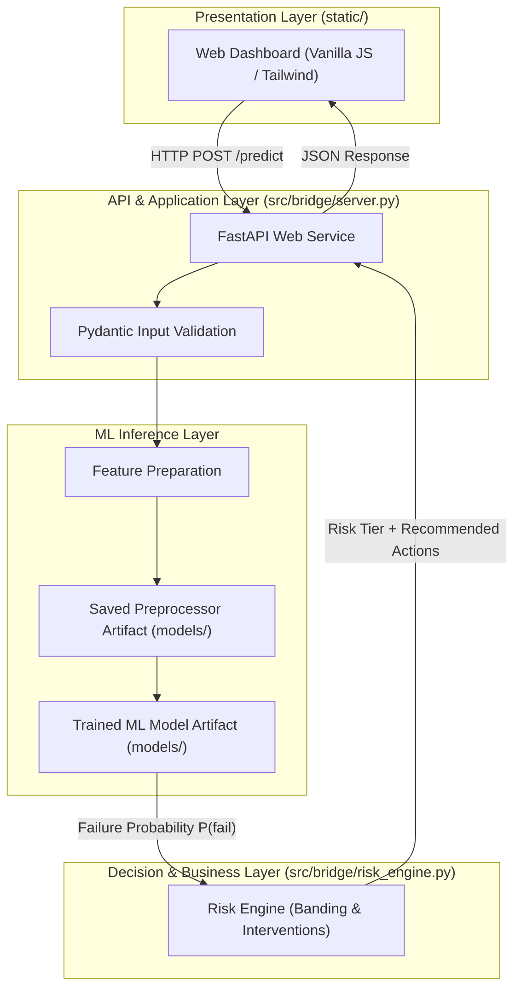

# SYSTEM ARCHITECTURE: BRIDGE RUNTIME & APPLICATION

This document outlines the software engineering architecture of **BRIDGE**, detailing layer separation, module boundaries, data contracts, and design principles.

---

## 1. High-Level System Architecture



---

## 2. Component Directory Structure

```text
src/bridge/
├── __init__.py               <- Package metadata
├── feature_engine.py         <- Offline data transformation & feature engineering logic
├── train_risk_model.py       <- Offline model training, evaluation & artifact serialization
├── risk_engine.py            <- Runtime business decision & intervention layer
└── server.py                 <- FastAPI application endpoints & service lifecycle
```

---

## 3. Strict Module Responsibilities

### 1. `feature_engine.py` (Offline Data Processing)
- **Primary Responsibility:** Transforming cleaned tabular datasets into ML-ready feature matrices.
- **Boundaries:** Must NOT serve HTTP requests, train models, or execute business decisions.

### 2. `train_risk_model.py` (Offline Training & Validation)
- **Primary Responsibility:** Group-aware train/test splitting, training-only preprocessor fitting, model training, cross-validation metrics computation, and serializing model artifacts into `models/`.
- **Boundaries:** Must NOT execute at API runtime; must NOT calculate metrics on whole datasets prior to splitting.

### 3. `risk_engine.py` (Runtime Decision Layer)
- **Primary Responsibility:** Taking raw model probability outputs $P(\text{failure})$ and evaluating business logic:
  - Classifying into risk tiers (`LOW`, `MEDIUM`, `HIGH`).
  - Diagnosing primary contributing risk drivers (e.g., preference mismatch, access difficulty).
  - Prescribing automated customer interventions (SMS alerts, locker diversions, gate code requests).
- **Boundaries:** Must NOT contain ML model training logic, database migrations, or presentation HTML/CSS.

### 4. `server.py` (FastAPI Web Application)
- **Primary Responsibility:** Handling client HTTP connections, validating input payloads via Pydantic, executing single-record and batch feature preparation, calling loaded model artifacts, and returning structured JSON.
- **Boundaries:** Must NOT retrain models dynamically per request. Must load serialized model weights once during application startup.

### 5. `static/` (Presentation Layer)
- **Primary Responsibility:** Providing route supervisors and dispatchers with an interactive dashboard to inspect route risk profiles, preview individual package risk scores, and simulate intervention workflows.
- **Boundaries:** Communicates strictly via standard RESTful API calls to `server.py`.

---

## 4. Separation of Concerns & Anti-Patterns to Avoid

| Anti-Pattern | Correct Design in BRIDGE |
| :--- | :--- |
| **Model retraining during API requests** | Load pre-trained models into memory at server startup using FastAPI lifespan events. |
| **Mixing risk thresholds with ML inference** | The ML model outputs pure calibrated probabilities $[0.0, 1.0]$. The Risk Engine independently manages business thresholds. |
| **Target encoding on full datasets** | Compute all statistical aggregates exclusively within training splits during offline training. |
| **Frontend business logic** | The presentation layer displays data; risk categorizations and action recommendations are generated by `risk_engine.py`. |
