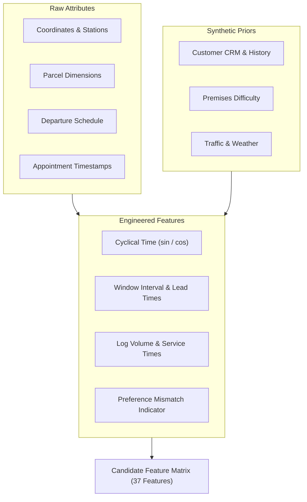

# MACHINE LEARNING PIPELINE: BRIDGE ARCHITECTURE & LIFECYCLE

This document specifies the end-to-end machine learning engineering pipeline for **BRIDGE**, distinguishing the offline modeling workflow from the online runtime inference service.

---

## 1. System Workflows: Offline vs. Runtime

```text
========================================================================================
A. OFFLINE DEVELOPMENT / ML WORKFLOW
========================================================================================
Source Dataset (Raw JSON)
      ↓
Phase 1.4: Cleaning & Validation
      ↓
Phase 1.6: Synthetic Augmentation & Target Generation
      ↓
Phase 1.7: Feature Engineering (37 Candidate ML Features)
      ↓
Phase 2.1: Group-Aware / Temporal Train-Val-Test Split
      ↓
Training-Only Preprocessing (Imputation, OneHot, Scaling)
      ↓
Phase 2.2: Model Training (Logistic Regression, Random Forest)
      ↓
Evaluation (PR-AUC, ROC-AUC, Brier Score, Calibration)
      ↓
Export Model & Preprocessor Artifacts (models/)

========================================================================================
B. RUNTIME INFERENCE & APPLICATION WORKFLOW
========================================================================================
Frontend Web Client (static/)
      ↓
FastAPI Dispatch API (src/bridge/server.py)
      ↓
Pydantic Request Validation
      ↓
Feature Preparation
      ↓
Load Preprocessor Artifact
      ↓
Load ML Model Artifact
      ↓
Output Failure Probability P(failure)
      ↓
Risk Decision Engine (src/bridge/risk_engine.py)
      ↓
Determine Risk Band (LOW / MEDIUM / HIGH) + Prescribe Intervention
      ↓
JSON Response -> Frontend Dashboard
========================================================================================
```

---

## 2. Feature Engineering & Pre-Dispatch Representation (Phase 1.7)

The offline pipeline (`src/feature_engineering.py`) derives 37 candidate features logically available prior to dispatch:



---

## 3. Planned Phase 2.1: Train/Val/Test Split & Preprocessing Strategy

> **Notice:** Phase 2.1 is documented here as an architectural specification. It is NOT implemented during repository initialization.

### A. Split Architecture
- **Group Leakage Prevention:** Naive random package-level train/test splitting is strictly prohibited. Parcels sharing the same `route_id` share driver behavior, van packing sequence, traffic delays, and localized weather.
- **Methodology:** Use `GroupKFold(n_splits=5)` grouped on `route_id` for cross-validation, combined with an out-of-time test holdout on `delivery_date` (e.g., late August 2018 routes reserved for final validation).

### B. Training-Only Transformations
All transformers must be fitted strictly on training folds:
1. **Numerical Imputation:** 
   - Time-window numerical features (`window_start_minutes`, `departure_to_window_start_minutes`, etc.) have ~92.18% missingness. For tree models, keep `NaN` natively; for linear models, impute with $-1$ alongside `has_time_window`.
2. **Categorical Encoding:**
   - Use `OneHotEncoder(handle_unknown="ignore")` for `station_code` (17 levels), `preferred_delivery_method` (7 levels), and `customer_delivery_preference` (5 levels).
3. **Feature Scaling:**
   - Fit `StandardScaler` on training folds only for linear estimators. Tree models do not require feature scaling.
4. **Zone Frequency Encoding:**
   - If zone frequencies are utilized, compute frequency counts **only on the training split** and map onto validation/test data.

---

## 4. Planned Phase 2.2: Model Evaluation & Metric Selection

Given the calibrated class imbalance ($\approx 9.14\%$ failure rate):
- **Primary Metric:** **PR-AUC (Precision-Recall Area Under Curve / Average Precision)**. PR-AUC focuses on performance on the minority failure class without being skewed by large true-negative volumes.
- **Secondary Metrics:** ROC-AUC, Brier score (probability calibration), F1-Score at operationally tuned thresholds.
- **Prohibited Evaluation:** Accuracy must **never** be used as a primary selection metric (a trivial majority classifier achieves 90.86% accuracy while failing 100% of deliveries).

---

## 5. Risk Decision Engine Design (`src/bridge/risk_engine.py`)

The Risk Engine consumes the calibrated failure probability $P(\text{failure})$ and maps it into operational actions:

| Risk Tier | Probability Range (Indicative) | Dispatch Intervention |
| :--- | :--- | :--- |
| **LOW** | $P < 0.10$ | Standard dispatch to van; unattended delivery authorized. |
| **MEDIUM** | $0.10 \le P < 0.25$ | Send automated customer SMS confirmation; request gate code or alternate safe place. |
| **HIGH** | $P \ge 0.25$ | Require delivery window re-booking, re-route to parcel locker, or schedule evening driver shift. |

*Exact operational thresholds will be calibrated during Phase 2.2 based on the cost of false positives vs. false negatives.*
